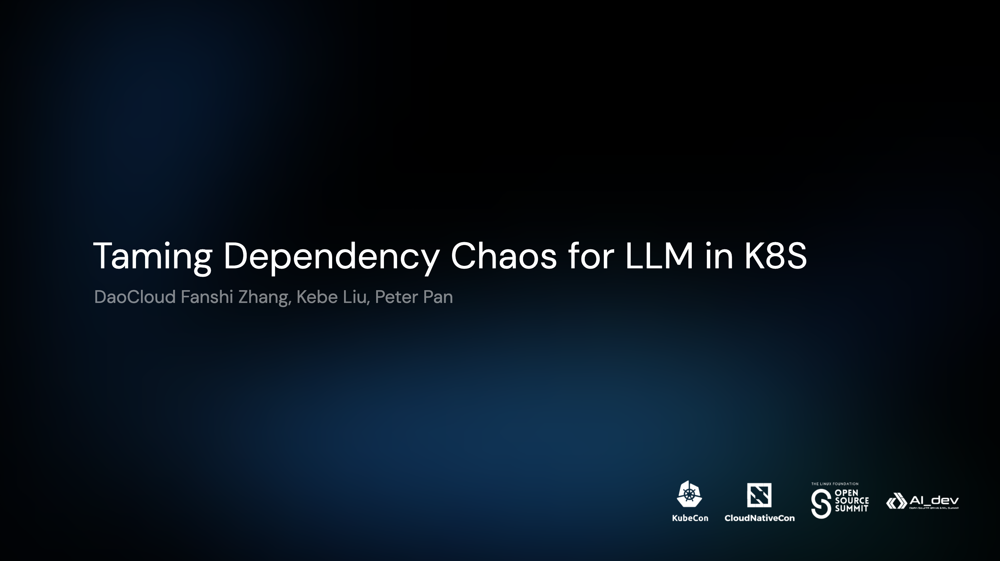

# Talks

> Public talks we presented historically
>
> 历史上我们参与过的全部公开分享

## Upcoming...

|  |  |
| --- | --- |

## Presented...

|  |  |
| --- | --- |
|  | 2025.06.11 @ Hong Kong |
| Taming Dependency Chaos for LLM in K8S (🇬🇧) | [Slides](https://baizeai.github.io/talks/2025-06-11-kubecon-hk/) |
|  | 2024.08.21 @ Hong Kong |
| Sit Back and Relax with Fault Awareness and Robust Instant Recovery for Large Scale AI Workloads (🇬🇧) | [Slides](https://baizeai.github.io/talks/2024-08-21-kubecon-hk/) |
